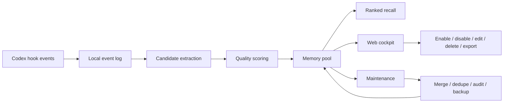

<div align="center">
  
  <h1>Horizon Context Memory</h1>
  <p><strong>Local-first memory, ranked recall, and self-evolution for Codex-style agents.</strong></p>
  <p>
    <a href="https://github.com/logcjj/horizon-context-memory/blob/main/LICENSE"></a>
    
    
    
  </p>
</div>


## Overview

**Horizon Context Memory** (`hcm`) is a local memory cockpit for agent workflows. It captures durable context from Codex hook events, promotes high-confidence memories, ranks recall per turn, and keeps control in a browser UI.

The goal is not to store everything. The goal is to make memory useful: selective capture, visible evidence, reversible maintenance, and portable local data.

## Highlights

| Area | What HCM provides |
| --- | --- |
| Memory capture | Hook-based event capture for prompts, sessions, tool activity, workflows, project rules, preferences, and failure lessons. |
| Memory quality | Confidence scoring, lifecycle hints, low-quality detection, duplicate cleanup, and pending review buckets. |
| Deep recall | A large local pool with bounded per-turn injection so recall stays relevant instead of noisy. |
| Web cockpit | Search, filters, details, evidence, editing, enable/disable, delete, disabled-memory purge, batch review, and one-click ZIP export. |
| Safety | Local-only storage, advisory memories, sensitive-value blocking, audit trail, backups, and reversible cleanup. |
| Portability | `hcm-memory-export-*.zip` contains the memory store, markdown mirrors, audit log, events, backups, config, and skill proposals. |

## Quick Start

```bash
git clone https://github.com/logcjj/horizon-context-memory.git
cd horizon-context-memory
./install.sh
```

Restart the terminal, then open the cockpit:

```bash
hcm
```

Default local URL:

```text
http://127.0.0.1:38987
```

## Web Cockpit

Daily usage is intentionally web-first. The top-level views are `All`, `USER`, `MEMORY`, and `Pending`.

`USER` memories are cross-project preferences. `MEMORY` stores project and workflow knowledge. `Pending` collects disabled memories, review candidates, low-quality items, cleanup suggestions, and conflicts.

Use **删除关闭记忆** to purge all disabled memories after confirmation. HCM creates a local backup first and records each removed memory in the audit log.

Use **导出 ZIP** in the cockpit to export a portable archive for migration or backup. The export is generated locally and is downloaded by the browser; no memory data is uploaded.

## Memory Model

| Layer | Stored in | Role |
| --- | --- | --- |
| `USER` | `~/.codex/hcm/data/USER.md` | Human-readable global preferences. |
| `MEMORY` | `~/.codex/hcm/data/MEMORY.md` | Human-readable project rules, tools, workflows, and lessons. |
| Source of truth | `~/.codex/hcm/data/memories.json` | Structured memory status, scope, lifecycle, evidence, quality, and usage metadata. |
| Event history | `~/.codex/hcm/data/events/*.jsonl` | Local evidence for memory creation and review. |
| Audit trail | `~/.codex/hcm/data/audit.jsonl` | Restore path for edits, disables, merges, and deletes. |

Default depth profile:

```text
Stored memories: 5000
Enabled memories: 2000
Per-turn recall: 24
Captured prompt/tool text: 4000 chars
```

## How It Works



## Completed

| Capability | Status |
| --- | --- |
| Local web cockpit | Done |
| Automatic hook capture | Done |
| USER / MEMORY split | Done |
| Quality scoring and pending buckets | Done |
| Ranked recall context | Done |
| Search and evidence inspection | Done |
| Enable, disable, edit, delete, disabled-memory purge, and batch actions | Done |
| Audit restore and automatic backups | Done |
| Legacy `hermes-codex` data migration | Done |
| Idempotent `hcm` startup when the server is already running | Done |
| One-click ZIP memory export | Done |

## Roadmap

| Track | Planned direction |
| --- | --- |
| Import flow | Web-based ZIP import with diff preview before applying. |
| Recall analytics | Per-memory usefulness ranking, stale-memory decay, and recall hit visualization. |
| Conflict resolution | Dedicated UI for contradictory rules and preference changes. |
| Privacy controls | More configurable redaction policies and export filters. |
| Multi-agent sync | Safer workflows for sharing selected memories across machines or agent profiles. |
| Release packaging | Versioned releases, signed archives, and installer hardening. |

## Codex Integration

After installation, the hook wrapper is available at:

```text
~/.codex/hcm/bin/codex-hook-wrapper
```

Wire this wrapper into your Codex hook configuration to enable automatic capture and context injection. If `oh-my-codex` native hooks are already installed, HCM preserves and merges their hook output instead of replacing it.

## Architecture

```text
bin/hcm                  opens or reuses the local web cockpit
bin/hcm-core             internal engine for hooks, recall, review, and diagnostics
bin/codex-hook-wrapper   Codex hook bridge
web/server.js            local-only HTTP API on 127.0.0.1
web/index.html           single-file cockpit UI
~/.codex/hcm/data        memories, events, audit log, backups, and search index
```

See `ARCHITECTURE.md` for the implementation model.

## Safety Model

HCM treats memory as advisory context, not verified truth. Repository facts should still be checked against current files before action. Sensitive-looking values are blocked or redacted by the capture layer. Destructive review suggestions disable memories first instead of hard-deleting them. The web purge action only removes disabled memories, creates a local backup first, and keeps audit entries for recovery review. Exported ZIP archives may contain private local memory data and should be treated as sensitive.

## Status

This is an early open-source release focused on the memory and self-evolution layer: capture, quality scoring, deep recall, lifecycle maintenance, local web management, auditability, and migration.

## License

MIT

## Disclaimer

Horizon Context Memory is independent software. It is not affiliated with Hermes, Codex, OpenAI, Anthropic, OMO, or any other agent-memory project.
