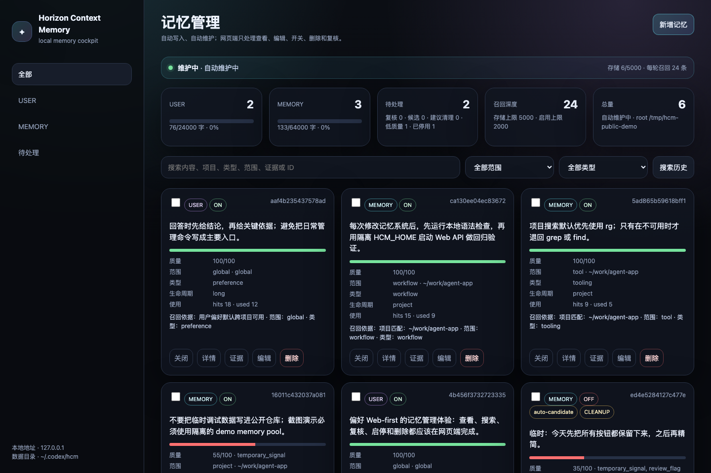

<div align="center">
  
  <h1>Horizon Context Memory</h1>
  <p><strong>A local-first memory and self-evolution cockpit for Codex-style agents.</strong></p>
  <p>
    <a href="https://github.com/logcjj/horizon-context-memory/blob/main/LICENSE"></a>
    
    
    
  </p>
</div>



## What is HCM?

**HCM** means **Horizon Context Memory**. It gives Codex-style agents a durable memory pool, automatic memory hygiene, ranked recall, and a local web cockpit for human control.

The daily command stays minimal:

```bash
hcm
```

`hcm` opens the cockpit. Normal memory work happens in the browser: view, search, inspect evidence, edit, enable, disable, delete, and review pending items.

## Why it matters

Most agent memory systems fail in one of three ways: they forget useful context, remember noisy context, or make cleanup unsafe. HCM is built around the opposite defaults.

| Capability | Behavior |
| --- | --- |
| Automatic capture | Records Codex hook events and mines durable preferences, workflows, tools, environments, and failure lessons. |
| Conservative promotion | Scores candidates before they become active memories. Weak or temporary items stay reviewable. |
| Deep recall | Stores a large pool, but injects only the most relevant memories per turn. |
| Reversible evolution | Merge, dedupe, disable, restore, backup, and LLM review are audited. |
| Local-first control | Memory data stays under `~/.codex/hcm/data`; the UI binds to `127.0.0.1`. |

## Quick start

```bash
git clone https://github.com/logcjj/horizon-context-memory.git
cd horizon-context-memory
./install.sh
```

Restart the terminal, then run:

```bash
hcm
```

Default cockpit URL:

```text
http://127.0.0.1:38987
```

## Memory model

HCM separates personal preference from project knowledge.

| Layer | Stored in | Typical content |
| --- | --- | --- |
| `USER` | `USER.md` mirror | Global preferences, response style, personal workflow defaults. |
| `MEMORY` | `MEMORY.md` mirror | Project rules, tools, environment facts, commands, failure lessons. |
| Source of truth | `memories.json` | Structured status, scope, quality, lifecycle, evidence, and audit metadata. |

Default depth profile:

```text
Stored memories: 5000
Enabled memories: 2000
Per-turn recall: 24
Captured prompt/tool text: 4000 chars
```

## Evolution loop


## Codex integration

After installation, the hook wrapper is available at:

```text
~/.codex/hcm/bin/codex-hook-wrapper
```

Wire this wrapper into your Codex hook configuration to enable automatic capture and context injection. If `oh-my-codex` native hooks are already installed, HCM preserves and merges their hook output instead of replacing it.

## Local architecture

```text
bin/hcm                  opens the local web cockpit
bin/hcm-core             internal engine for hooks, recall, review, and diagnostics
bin/codex-hook-wrapper   Codex hook bridge
web/server.js            local-only HTTP API on 127.0.0.1
web/index.html           single-file cockpit UI
~/.codex/hcm/data        local memories, events, audit log, backups, and search index
```

See `ARCHITECTURE.md` for the implementation model.

## Safety model

HCM treats memory as advisory context, not verified truth. Repository facts should still be checked against current files before action. Sensitive-looking values are blocked or redacted by the capture layer. Destructive review suggestions disable memories first instead of hard-deleting them. Skill proposals are generated as candidates and are not auto-installed by default.

## Status

This is an early open-source release focused on the memory and self-evolution layer: capture, quality scoring, deep recall, lifecycle maintenance, local web management, and auditability.

## License

MIT

## Disclaimer

Horizon Context Memory is independent software. It is not affiliated with Hermes, Codex, OpenAI, Anthropic, OMO, or any other agent-memory project.
